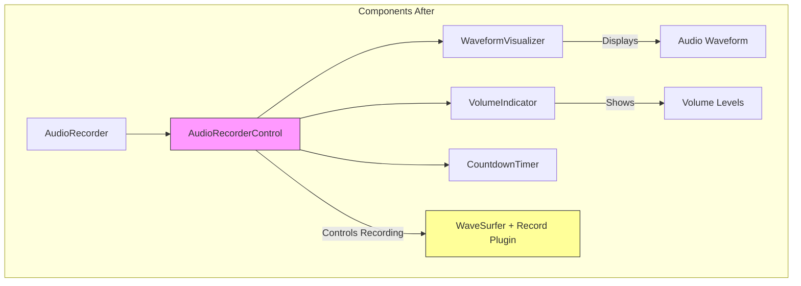
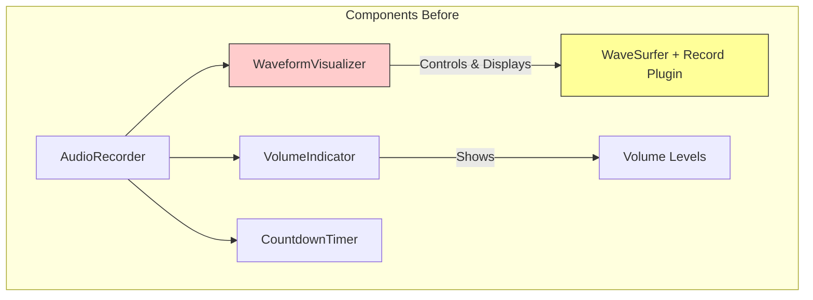

# Audio Recording Component Refactor Plan

## Current Issues

Our current implementation has the following problems:

1. WaveformVisualizer is doing too much:
   - Handling recording state
   - Managing permissions
   - Controlling MediaRecorder
   - Visualizing audio data

2. Permission handling is scattered:
   - Basic checks in BrowserCheck
   - Permission requests in AudioRecorder
   - Stream handling in WaveformVisualizer

3. State management is duplicated:
   - Recording state in AudioRecorder
   - Recording state in WaveformVisualizer
   - No single source of truth

## Proposed Architecture



Compare this with our current architecture:



## Component Implementations

### 1. AudioRecorderControl Implementation

```typescript
// src/components/AudioRecorderControl.tsx

interface AudioRecorderControls {
  checkPermission: () => Promise<boolean>
  hasPermission: () => boolean | null
  startRecording: () => Promise<void>
  stopRecording: () => Promise<void>
  pauseRecording: () => void
  resumeRecording: () => void
}

interface AudioRecorderControlProps {
  onRecordingData: (data: Float32Array) => void
  onStateChange: (state: { isRecording: boolean; isPaused: boolean }) => void
  onPermissionChange: (hasPermission: boolean | null) => void
  onError: (error: Error) => void
  children: React.ReactNode
}

export const AudioRecorderControl = forwardRef<AudioRecorderControls, AudioRecorderControlProps>((
  { onRecordingData, onStateChange, onPermissionChange, onError, children },
  ref
) => {
  // Core refs for WaveSurfer
  const wavesurfer = useRef<WaveSurfer | null>(null)
  const recordPlugin = useRef<any>(null)
  const [permissionState, setPermissionState] = useState<boolean | null>(null)

  // Initialize WaveSurfer in hidden container
  useEffect(() => {
    const ws = WaveSurfer.create({
      container: document.createElement('div'), // Hidden container
      waveColor: '#3B82F6',
      progressColor: '#1E40AF',
      cursorColor: '#1E40AF',
      cursorWidth: 2,
      height: 128,
      normalize: false,
      dragToSeek: false,
      autoScroll: true,
      hideScrollbar: true,
      minPxPerSec: 50,
      autoCenter: true,
      fillParent: true,
      interact: false
    })
    
    wavesurfer.current = ws
    
    recordPlugin.current = ws.registerPlugin(Record.create({
      mimeType: 'audio/webm',
      audioBitsPerSecond: 128000,
      renderRecordedAudio: true,
      scrollingWaveform: true,
      scrollingWaveformWindow: 3,
      continuousWaveform: false,
      mediaRecorderTimeslice: 50
    }))

    // Set up plugin event handlers
    if (recordPlugin.current) {
      recordPlugin.current.on('record-progress', (data: Float32Array) => {
        onRecordingData(data)
      })

      recordPlugin.current.on('record-start', () => {
        onStateChange({ isRecording: true, isPaused: false })
      })

      recordPlugin.current.on('record-end', () => {
        onStateChange({ isRecording: false, isPaused: false })
      })

      recordPlugin.current.on('record-pause', () => {
        onStateChange({ isRecording: true, isPaused: true })
      })

      recordPlugin.current.on('record-resume', () => {
        onStateChange({ isRecording: true, isPaused: false })
      })

      recordPlugin.current.on('record-error', (error: Error) => {
        onError(error)
      })
    }

    return () => ws.destroy()
  }, [onRecordingData, onStateChange, onError])

  // Permission checking implementation
  const checkPermission = useCallback(async () => {
    try {
      const stream = await navigator.mediaDevices.getUserMedia({
        audio: {
          echoCancellation: true,
          noiseSuppression: true,
          sampleRate: 48000,
        }
      })
      stream.getTracks().forEach(track => track.stop())
      setPermissionState(true)
      onPermissionChange(true)
      return true
    } catch (error) {
      setPermissionState(false)
      onPermissionChange(false)
      onError(error instanceof Error ? error : new Error('Permission denied'))
      return false
    }
  }, [onPermissionChange, onError])

  // Expose controls via ref
  useImperativeHandle(ref, () => ({
    checkPermission,
    hasPermission: () => permissionState,
    startRecording: async () => {
      if (!permissionState) {
        const granted = await checkPermission()
        if (!granted) throw new Error('Permission required')
      }
      await recordPlugin.current?.startRecording()
    },
    pauseRecording: () => {
      recordPlugin.current?.pauseRecording()
    },
    resumeRecording: () => {
      recordPlugin.current?.resumeRecording()
    },
    stopRecording: async () => {
      const blob = await recordPlugin.current?.stopRecording()
      return blob
    }
  }), [permissionState, checkPermission])

  return <>{children}</>
})
```

### 2. WaveformVisualizer Implementation

```typescript
// src/components/WaveformVisualizer.tsx

interface WaveformVisualizerProps {
  audioData: Float32Array | null
  isRecording: boolean
  isPaused: boolean
  className?: string
}

export function WaveformVisualizer({
  audioData,
  isRecording,
  isPaused,
  className = ''
}: WaveformVisualizerProps) {
  const containerRef = useRef<HTMLDivElement>(null)
  const wavesurfer = useRef<WaveSurfer | null>(null)

  // Set up visualization-only WaveSurfer instance
  useEffect(() => {
    if (!containerRef.current) return

    const ws = WaveSurfer.create({
      container: containerRef.current,
      waveColor: '#3B82F6',
      progressColor: '#1E40AF',
      cursorColor: '#1E40AF',
      cursorWidth: 2,
      height: 128,
      normalize: false,
      dragToSeek: !isRecording,
      autoScroll: true,
      hideScrollbar: true,
      minPxPerSec: 50,
      autoCenter: true,
      fillParent: true,
      interact: false
    })
    wavesurfer.current = ws

    return () => ws.destroy()
  }, [])

  // Update visualization when data changes
  useEffect(() => {
    if (audioData && wavesurfer.current) {
      wavesurfer.current.loadDecodedBuffer(audioData)
    }
  }, [audioData])

  return (
    <div 
      ref={containerRef}
      className={`
        h-32 bg-gray-50 rounded-lg border-2
        ${isRecording ? 'border-red-200' : 'border-gray-200'}
        ${className}
      `}
    />
  )
}
```

### 3. AudioRecorder Implementation

```typescript
// src/components/AudioRecorder.tsx

export function AudioRecorder({ onRecordingComplete, onCancel }: AudioRecorderProps) {
  const recorderRef = useRef<AudioRecorderControls>(null)
  const [isRecording, setIsRecording] = useState(false)
  const [isPaused, setIsPaused] = useState(false)
  const [audioData, setAudioData] = useState<Float32Array | null>(null)
  const [error, setError] = useState<Error | null>(null)
  const [permissionState, setPermissionState] = useState<boolean | null>(null)

  // Handle state changes from AudioRecorderControl
  const handleStateChange = useCallback(({ isRecording, isPaused }) => {
    setIsRecording(isRecording)
    setIsPaused(isPaused)
  }, [])

  // Permission denied UI
  if (permissionState === false) {
    return (
      <div className="rounded-lg bg-red-50 p-4">
        <h3 className="text-lg font-medium text-red-800">
          Microphone Access Denied
        </h3>
        <p className="mt-2 text-sm text-red-700">
          Microphone access is required for audio recording. Please check your
          browser settings to allow microphone access for this site.
        </p>
        <div className="mt-4">
          <button
            onClick={onCancel}
            className="bg-gray-100 hover:bg-gray-200 text-gray-800 font-medium py-2 px-4 rounded-lg transition-colors"
          >
            Cancel
          </button>
        </div>
      </div>
    )
  }

  return (
    <AudioRecorderControl
      ref={recorderRef}
      onRecordingData={setAudioData}
      onStateChange={handleStateChange}
      onPermissionChange={setPermissionState}
      onError={setError}
    >
      <div className="space-y-6">
        <ErrorModal
          isOpen={error !== null}
          onClose={() => setError(null)}
          title="Recording Error"
          description={error?.message}
        />

        <WaveformVisualizer
          audioData={audioData}
          isRecording={isRecording}
          isPaused={isPaused}
          className="w-full"
        />

        <VolumeIndicator /* ... existing props ... */ />

        <div className="flex justify-center space-x-4">
          {!isRecording ? (
            <>
              <button
                onClick={async () => {
                  try {
                    await recorderRef.current?.startRecording()
                  } catch (error) {
                    setError(error instanceof Error ? error : new Error('Failed to start recording'))
                  }
                }}
                className="bg-red-500 hover:bg-red-600 text-white font-medium py-2 px-6 rounded-lg"
              >
                Start Recording
              </button>
              <button onClick={onCancel} className="bg-gray-100 hover:bg-gray-200 text-gray-800 font-medium py-2 px-4 rounded-lg">
                Cancel
              </button>
            </>
          ) : (
            <>
              <button
                onClick={() => {
                  if (isPaused) {
                    recorderRef.current?.resumeRecording()
                  } else {
                    recorderRef.current?.pauseRecording()
                  }
                }}
                className="bg-gray-100 hover:bg-gray-200 text-gray-800 font-medium py-2 px-4 rounded-lg"
              >
                {isPaused ? 'Resume' : 'Pause'}
              </button>
              <button
                onClick={async () => {
                  try {
                    const blob = await recorderRef.current?.stopRecording()
                    if (blob) onRecordingComplete(blob)
                  } catch (error) {
                    setError(error instanceof Error ? error : new Error('Failed to stop recording'))
                  }
                }}
                className="bg-blue-500 hover:bg-blue-600 text-white font-medium py-2 px-6 rounded-lg"
              >
                Finish Recording
              </button>
            </>
          )}
        </div>
      </div>
    </AudioRecorderControl>
  )
}
```

## Implementation Steps

1. Create the New Files:
```bash
mkdir -p src/components/__tests__
touch src/components/AudioRecorderControl.tsx
touch src/components/WaveformVisualizer.tsx
touch src/components/__tests__/AudioRecorderControl.test.tsx
touch src/components/__tests__/WaveformVisualizer.test.tsx
```

2. Move Existing Files:
```bash
mv src/components/WaveformVisualizer.tsx src/components/WaveformVisualizerOld.tsx
```

3. Add Test Files

```typescript
// src/components/__tests__/AudioRecorderControl.test.tsx

describe('AudioRecorderControl', () => {
  beforeEach(() => {
    // Mock MediaDevices API
    global.navigator.mediaDevices = {
      getUserMedia: vi.fn()
    } as any
  })

  it('manages permission state', async () => {
    const onPermissionChange = vi.fn()
    const { result } = renderHook(() => {
      const ref = useRef<AudioRecorderControls>(null)
      const { rerender } = render(
        <AudioRecorderControl
          ref={ref}
          onPermissionChange={onPermissionChange}
          onStateChange={() => {}}
          onRecordingData={() => {}}
          onError={() => {}}
        >
          <div />
        </AudioRecorderControl>
      )
      return { ref, rerender }
    })

    // Test permission granted
    global.navigator.mediaDevices.getUserMedia.mockResolvedValueOnce({
      getTracks: () => [{ stop: () => {} }]
    })

    await act(async () => {
      await result.current.ref.current?.checkPermission()
    })

    expect(onPermissionChange).toHaveBeenCalledWith(true)
  })

  // Add more tests...
})
```

```typescript
// src/components/__tests__/WaveformVisualizer.test.tsx

describe('WaveformVisualizer', () => {
  it('displays audio data', () => {
    const audioData = new Float32Array([0, 0.5, 1, 0.5, 0])
    const { container } = render(
      <WaveformVisualizer
        audioData={audioData}
        isRecording={false}
        isPaused={false}
      />
    )
    
    expect(container.querySelector('canvas')).toBeInTheDocument()
  })

  // Add more tests...
})
```

4. Implementation Order:
   a. Create and test AudioRecorderControl
   b. Create and test WaveformVisualizer
   c. Update AudioRecorder to use new components
   d. Run integration tests
   e. Remove WaveformVisualizerOld once everything works

## Common Issues to Watch For

1. Permission Handling:
   - Make sure to check permission before recording
   - Handle permission changes during recording
   - Clean up MediaStreams properly

2. State Management:
   - Keep state synchronized between components
   - Handle all state transitions properly
   - Clean up state on unmount

3. Error Handling:
   - Handle initialization failures
   - Manage recording errors
   - Provide recovery paths

4. Performance:
   - Monitor memory usage
   - Clean up resources
   - Handle large recordings

## Testing Checklist

1. Permission Tests:
   - [ ] Initial permission request
   - [ ] Denied permissions
   - [ ] Revoked permissions
   - [ ] Re-requesting permissions

2. Recording Tests:
   - [ ] Start recording
   - [ ] Pause/resume
   - [ ] Stop recording
   - [ ] Record multiple times
   - [ ] Handle errors

3. Visualization Tests:
   - [ ] Display waveform
   - [ ] Update in real-time
   - [ ] Handle state changes
   - [ ] Clean up resources

4. Integration Tests:
   - [ ] Complete recording flow
   - [ ] Error recovery
   - [ ] State persistence
   - [ ] Component communication

## Benefits of New Architecture

1. Clear Separation of Concerns:
   - Recording logic isolated in AudioRecorderControl
   - Visualization separate from recording
   - UI composition in AudioRecorder

2. Better State Management:
   - Single source of truth
   - Clear data flow
   - Predictable updates

3. Improved Testing:
   - Components can be tested independently
   - Clear interfaces
   - Easier to mock dependencies

4. Enhanced Maintainability:
   - Each component has a single responsibility
   - Easier to understand
   - Simpler to modify

## Next Steps

1. Review the plan with team
2. Create new components one at a time
3. Write tests for each component
4. Update existing components
5. Run integration tests
6. Deploy and monitor

Remember:
- Keep the old implementation until the new one is fully tested
- Test thoroughly, especially permission handling
- Document any browser-specific issues found
- Consider mobile browser differences
