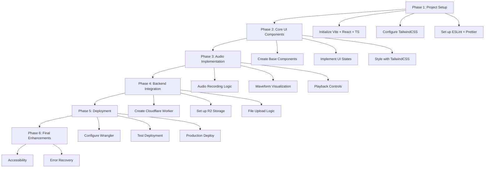
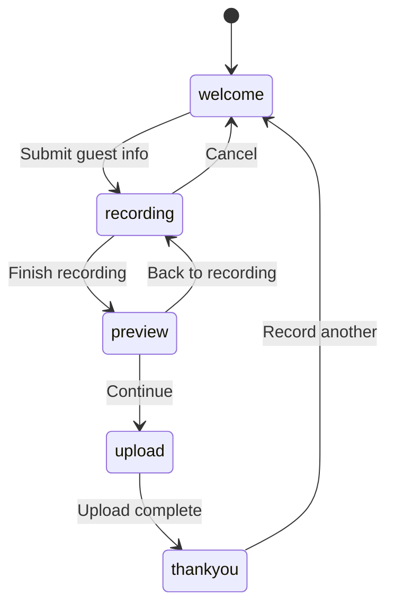
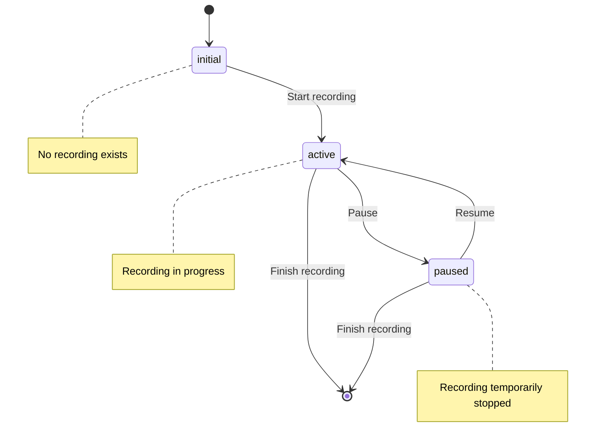

# Marc With A Sea Wedding Website

Code Phrase: "Waves of Love"

## Project Overview
A simple, focused web application that allows wedding guests to record audio greetings for Marc and Sea's wedding. Guests can record, preview, and save their messages. The audio files will be stored for later podcast creation. Built with TypeScript and React, deployed on Cloudflare using Workers for server-side functionality and R2 for storage.

## Implementation Plan

### Development Details

The dev server is already running on localhost:3000.

### Phase Details

1. **Project Setup** ✓
   - Use Vite's React + TypeScript template
   - Configure TailwindCSS with a custom theme that matches wedding aesthetics
   - Set up strict TypeScript configuration
   - Configure ESLint and Prettier for code quality

2. **Core UI Components** ✓
   - Implement state machine for the 5 UI states (Welcome → Recording → Preview → Upload → Thank You)
   - Create responsive layout with HeadlessUI components
   - Build form components for name collection with validation
   - Add progress indicators (1/5, 2/5, etc.)
   - Add countdown timer component (15-minute limit)
   - Implement recording controls (start/stop, cancel)
   - Add playback controls (play/pause, reset)
   - Create upload progress UI
   - Design thank you state with social sharing
   - Add smooth transitions between states
   - Implement error handling UI
   - Form validation with Zod schemas
   - Loading states & spinners
   - Browser compatibility checks
   - Mobile-responsive layout adjustments
   - Animation transitions between states

3. **Audio Implementation** ✓
   - Implement useAudioRecording hook with Web Audio API
   - Integrate Wavesurfer.js for visualization
   - Add recording controls with 15-minute limit
   - Implement preview functionality
   - Add volume level indicator

4. **Backend Integration**
   - Worker Setup
     - Initialize new Worker project
     - Configure TypeScript and environment
     - Set up CORS headers for frontend access
     - Add basic authentication to prevent abuse
   - R2 Storage Configuration
     - Create dedicated bucket for audio files
     - Set up access permissions
     - Configure CORS for frontend uploads
     - Define file retention policy
   - Upload Implementation
     - Create upload endpoint
     - Validate incoming files (type, size)
     - Handle chunked uploads
     - Implement error handling and retries
   - Frontend Integration
     - Create upload hook
     - Add progress tracking
     - Implement retry mechanism
     - Handle network errors

5. **Deployment**
   - Configure Wrangler for development
   - Set up CI/CD pipeline
   - Deploy to Cloudflare Pages
   - Perform end-to-end testing

6. **Final Enhancements**
   - Accessibility
     - Add ARIA labels for audio controls
     - Ensure keyboard navigation works
     - Add screen reader support for recording status
     - Test with assistive technologies
     - Add alt text for any images/icons
   - Error Recovery & Resilience
     - Implement local storage backup during recording
     - Add auto-retry for failed uploads
     - Add session recovery if browser crashes
     - Handle offline scenarios gracefully
     - Add clear error recovery instructions for users

## Navigation and Recording State Design

### Navigation Flow

The application will follow a linear navigation flow between states:

This linear flow ensures users follow a consistent path through the application:
- From welcome screen, users can only proceed to recording after submitting their information
- From recording, users can either cancel (returning to welcome) or finish recording (proceeding to preview)
- From preview, users can go back to continue recording or proceed to upload
- From upload, users can only proceed to the thank you screen once upload is complete
- From thank you, users can start over by returning to the welcome screen

### Recording State Management

The recording functionality will have three distinct states:

These recording states work as follows:
- **initial**: No prior recording exists, a new one will be initialized when the user starts recording
- **active**: Recording is in progress, audio is being captured and appended to any existing recording
- **paused**: Recording was previously active but is currently paused, can be resumed

Key behaviors:
1. When entering the recording navigation state, we start in either:
   - **initial** state (if no prior recording or after reset)
   - **paused** state (if returning from preview with an existing recording)
2. UI in recording view changes based on recording state:
   - **initial**: Show "Start Recording" button
   - **active**: Show "Pause" and "Finish Recording" buttons
   - **paused**: Show "Resume" and "Finish Recording" buttons
3. Recording state persists when navigating between recording and preview views
4. Recording resets to **initial** state only when:
   - User clicks "cancel" during recording view
   - User completes the flow and reaches "thankyou" view

This approach ensures that users can navigate back and forth between recording and preview without losing their recording progress, while maintaining a clear and intuitive user experience.

## To Do
- [x] Set up project structure with TypeScript, Vite, and React
- [x] Configure TailwindCSS and HeadlessUI
- [x] Create basic component structure
- [x] Complete Phase 2: Core UI Components
  - [x] Implement WelcomeForm with name collection and validation
  - [x] Create CountdownTimer component with progress ring
  - [x] Build recording controls and VolumeIndicator
  - [x] Add progress indicators and transitions
  - [x] Implement error handling UI and ErrorBoundary
  - [x] Add BrowserCheck component
  - [x] Create LoadingSpinner component
  - [x] Implement ErrorModal for alerts
  - [x] Add PermissionPrompt for microphone access
  - [x] Add form validation with Zod
  - [x] Design upload progress view with ProgressBar
  - [x] Create thank you state with sharing options
  - [x] Create responsive layouts for mobile
- [x] Complete Phase 3: Audio Implementation
  - [x] Implement basic record/pause/resume functionality
  - [x] Add 15-minute duration limit
  - [x] Integrate WaveSurfer.js for visualization
  - [x] Add volume level indicator
  - [x] Implement error handling
  - [x] Add basic preview playback
- [ ] Improve Browser Navigation
  - [ ] Implement linear state transitions
  - [ ] Fix recording state management
  - [ ] Research audio recording continuation
  - [ ] Test all navigation paths
- [ ] Complete Frontend Testing (Phase 1)
  - [ ] Test Welcome Form validation and flow
  - [ ] Test Audio Recording functionality
    - [ ] Test microphone permissions
    - [ ] Test recording controls
    - [ ] Test volume visualization
  - [ ] Test Audio Preview and Playback
    - [ ] Test playback controls
    - [ ] Verify audio quality
  - [ ] Test Upload UI with mock implementation
    - [ ] Test progress indicators
    - [ ] Test error states
  - [ ] Test complete UI flow and transitions
  - [ ] Perform cross-browser testing
    - [ ] Test on desktop browsers
    - [ ] Test on mobile devices
  - [ ] Test performance with long recordings
  - [ ] Document test results and issues
  - [ ] Fix audio format in WaveformVisualizer (change from webm to WAV)
  - [x] Add performance improvements (memoization) to WaveformVisualizer after backend integration

- [ ] Complete Phase 4: Backend Integration
  - [ ] Create upload Worker
  - [ ] Configure R2 storage
  - [ ] Implement file upload logic
  - [ ] Add upload progress tracking
  - [ ] Test backend implementation
    - [ ] Test worker functionality
    - [ ] Test R2 storage
    - [ ] Test API endpoints
    - [ ] Test security measures
    - [ ] Test error handling
  - [ ] Test complete end-to-end flow

- [ ] Deploy to Cloudflare
  - [ ] Configure production environment
  - [ ] Deploy frontend to Pages
  - [ ] Deploy worker
  - [ ] Verify production setup

- [ ] Complete Phase 6: Final Enhancements
  - [ ] Fix broken UI when audio device permission is refused
  - [ ] Implement Accessibility Features
    - [ ] Add ARIA labels for audio controls
    - [ ] Ensure keyboard navigation works
    - [ ] Add screen reader support
    - [ ] Test with assistive technologies
    - [ ] Add alt text for images/icons
  - [ ] Implement Error Recovery
    - [ ] Add local storage backup
    - [ ] Implement auto-retry for uploads
    - [ ] Add session recovery
    - [ ] Handle offline scenarios
    - [ ] Add recovery instructions

## Links
- [Back to Index](index.md)
- [Technical Details](marc-with-a-sea-technical.md)
- [Architecture](marc-with-a-sea-architecture.md)
- [Development Progress](marc-with-a-sea-progress.md)
