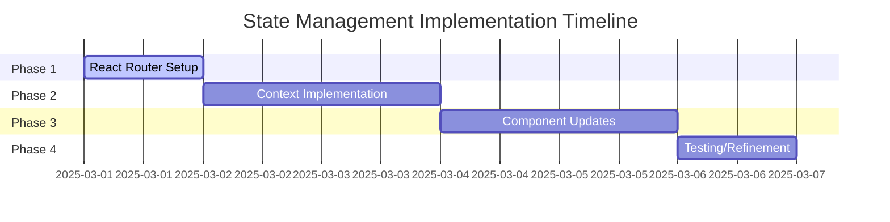

# State Management Implementation TODOs

## Completed Items ✓
- [x] Install react-router-dom@6.18+
- [x] Create `src/views` directory structure
- [x] Create `src/context/RecordingContext.tsx`
- [x] Implement core state machine logic
- [x] Add browser history integration
- [x] Create view components for each route
- [x] Convert App.tsx to use BrowserRouter
- [x] Basic route guards implementation

## Immediate Priority - Unit Testing

### Infrastructure Setup (Required for all tests)
- [x] Install test dependencies
  - [x] vitest
  - [x] @testing-library/react
  - [x] @testing-library/user-event
  - [x] @testing-library/jest-dom
  - [x] happy-dom
  - [x] @vitest/coverage-c8
- [x] Configure test environment
  - [x] Create vitest.config.ts
  - [x] Set up test utils directory structure
  - [x] Create test setup file
  - [x] Configure coverage reporting

### Primary Test Implementation
- [x] Write unit tests for RecordingContext navigation methods
  - [x] Test linear flow restrictions
  - [ ] Test history integration
  - [x] Test state preservation
  - [x] Test invalid transitions

- [x] Write unit tests for state transitions in RecordingContext
  - [x] Test recording state changes
  - [x] Test guest info updates
  - [x] Test audio blob management
  - [x] Test error state handling

- [ ] Write unit tests for view component redirects
  - [ ] Test missing state redirects
  - [ ] Test permission-based access
  - [ ] Test navigation guards
  - [ ] Test error boundaries

- [ ] Write unit tests for useAudioRecording hook
  - [ ] Test initialization
  - [ ] Test volume analysis
  - [ ] Test cleanup behavior
  - [ ] Test error states

- [ ] Write unit tests for utility functions in components
  - [ ] Test format functions
  - [ ] Test validation functions
  - [ ] Test audio processing utils
  - [ ] Test file handling utils

- [ ] Create test harness for MediaStream mocking
  - [ ] Mock audio input simulation
  - [ ] Mock volume level control
  - [ ] Mock error injection
  - [ ] Mock event timing

- [x] Add test coverage reporting
  - [x] Configure coverage thresholds
  - [x] Set up coverage reports
  - [ ] Add coverage badges
  - [x] Document coverage requirements

## Testing & QA
- [ ] Implement navigation flow tests
  - [x] Test basic navigation sequence
  - [ ] Test complete recording flow with required state
  - [ ] Test navigation between all views
  - [ ] Test non-linear navigation attempts
  - [ ] Test route guard effectiveness

- [ ] Verify browser back/forward behavior
  - [ ] Test history stack management
  - [ ] Test state sync with history
  - [ ] Test deep linking behavior
  - [ ] Test navigation interruption

- [ ] Test recording state persistence
  - [ ] Test state preservation during navigation
  - [ ] Test state recovery after page refresh
  - [ ] Test state cleanup on flow reset
  - [ ] Test concurrent session handling

- [ ] Error handling coverage
  - [x] Test invalid state transitions
  - [ ] Test network failure scenarios
  - [ ] Test API error responses
  - [ ] Test recovery procedures

- [ ] Test permission handling scenarios
  - [ ] Test initial permission requests
  - [ ] Test permission denial flows
  - [ ] Test permission revocation
  - [ ] Test re-request scenarios

- [ ] Test visualization state management
  - [ ] Test waveform rendering
  - [ ] Test visualization updates
  - [ ] Test state synchronization
  - [ ] Test memory management

- [ ] Performance testing for visualization updates
  - [ ] Measure render performance
  - [ ] Test high-load scenarios
  - [ ] Profile memory usage
  - [ ] Test device limitations

- [ ] Test audio quality and encoding
  - [ ] Test various audio inputs
  - [ ] Verify encoding quality
  - [ ] Test file size optimization
  - [ ] Validate playback quality

## High Priority - Recording Engine Abstraction
- [ ] Create `src/services/RecordingEngine.ts` interface and implementation
- [ ] Migrate MediaRecorder logic from WaveformVisualizer to RecordingEngine
- [ ] Implement permission handling in RecordingEngine
- [ ] Add unified error handling system
- [ ] Create RecordingEngineProvider context
- [ ] Update AudioRecorder to use RecordingEngine
- [ ] Write unit tests for RecordingEngine

## High Priority - WaveformVisualizer Integration
- [ ] Refactor WaveformVisualizer to be purely presentational
- [ ] Create WaveformVisualizerContext for state management
- [ ] Implement declarative API for WaveformVisualizer
- [ ] Add proper TypeScript interfaces for visualization state
- [ ] Create visualization state reducer
- [ ] Write integration tests for WaveformVisualizer

## Documentation
- [ ] Update technical documentation with new architecture
- [ ] Document RecordingEngine API
- [ ] Document visualization state management
- [x] Add inline documentation for context usage
- [x] Document error handling approaches
- [ ] Create example usage documentation
- [ ] Update architecture diagrams

## Future Improvements
- [ ] Consider transition animations
- [ ] Explore performance optimizations
- [ ] Add comprehensive error logging
- [ ] Consider WebAssembly for audio processing
- [ ] Add support for different audio formats
- [ ] Implement advanced waveform visualization options
