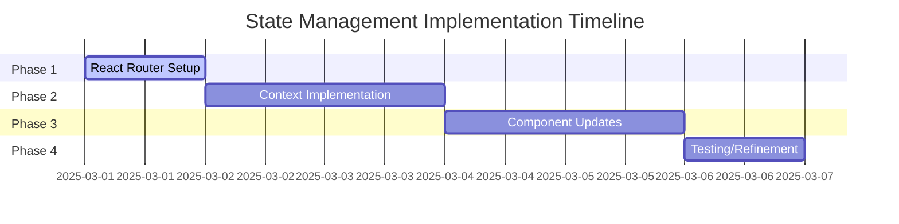

# State Management Implementation TODOs

## Completed Items ✓
- [x] Install react-router-dom@6.18+
- [x] Create `src/views` directory structure
- [x] Create `src/context/RecordingContext.tsx`
- [x] Implement core state machine logic
- [x] Add browser history integration
- [x] Create view components for each route
- [x] Convert App.tsx to use BrowserRouter
- [x] Basic route guards implementation

## Immediate Priority - Unit Testing
- [ ] Write unit tests for RecordingContext navigation methods
- [ ] Write unit tests for state transitions in RecordingContext
- [ ] Write unit tests for view component redirects
- [ ] Write unit tests for useAudioRecording hook
- [ ] Write unit tests for utility functions in components
- [ ] Create test harness for MediaStream mocking
- [ ] Add test coverage reporting

## High Priority - Recording Engine Abstraction
- [ ] Create `src/services/RecordingEngine.ts` interface and implementation
- [ ] Migrate MediaRecorder logic from WaveformVisualizer to RecordingEngine
- [ ] Implement permission handling in RecordingEngine
- [ ] Add unified error handling system
- [ ] Create RecordingEngineProvider context
- [ ] Update AudioRecorder to use RecordingEngine
- [ ] Write unit tests for RecordingEngine

## High Priority - WaveformVisualizer Integration
- [ ] Refactor WaveformVisualizer to be purely presentational
- [ ] Create WaveformVisualizerContext for state management
- [ ] Implement declarative API for WaveformVisualizer
- [ ] Add proper TypeScript interfaces for visualization state
- [ ] Create visualization state reducer
- [ ] Write integration tests for WaveformVisualizer

## Testing & QA
- [ ] Implement navigation flow tests
- [ ] Test recording state persistence
- [ ] Verify browser back/forward behavior
- [ ] Error handling coverage
- [ ] Test permission handling scenarios
- [ ] Test visualization state management
- [ ] Performance testing for visualization updates
- [ ] Test audio quality and encoding

## Documentation
- [ ] Update technical documentation with new architecture
- [ ] Document RecordingEngine API
- [ ] Document visualization state management
- [ ] Add inline documentation for context usage
- [ ] Document error handling approaches
- [ ] Create example usage documentation
- [ ] Update architecture diagrams

## Future Improvements
- [ ] Consider transition animations
- [ ] Explore performance optimizations
- [ ] Add comprehensive error logging
- [ ] Consider WebAssembly for audio processing
- [ ] Add support for different audio formats
- [ ] Implement advanced waveform visualization options
