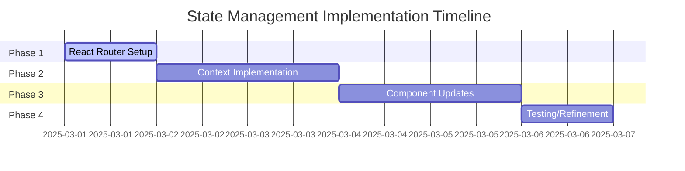

# State Management Implementation TODOs

## Phase 1: React Router Setup
- [ ] Install react-router-dom@6.18+
- [ ] Create `src/views` directory structure
- [ ] Convert App.tsx to use BrowserRouter
- [ ] Add basic route guards
- [ ] Write navigation smoke tests

## Phase 2: Context Implementation
- [ ] Create `src/context/RecordingContext.tsx` 
- [ ] Implement core state machine logic
- [ ] Add browser history integration
- [ ] Create WaveSurferRecordingEngine service
- [ ] Write context unit tests

## Phase 3: Component Updates
- [ ] Migrate AudioRecorder to use context
- [ ] Update WaveformVisualizer imperative API
- [ ] Create view components for each route
- [ ] Add transition animations
- [ ] Write component integration tests

## Phase 4: Testing
- [ ] Implement navigation flow Cypress tests
- [ ] Add recording state persistence checks
- [ ] Verify browser back/forward behavior
- [ ] Update type definitions (`src/types`)
- [ ] Document architecture changes

## Quality Assurance
- [ ] Performance profiling
- [ ] Accessibility audit
- [ ] Browser matrix testing
- [ ] Error logging integration
