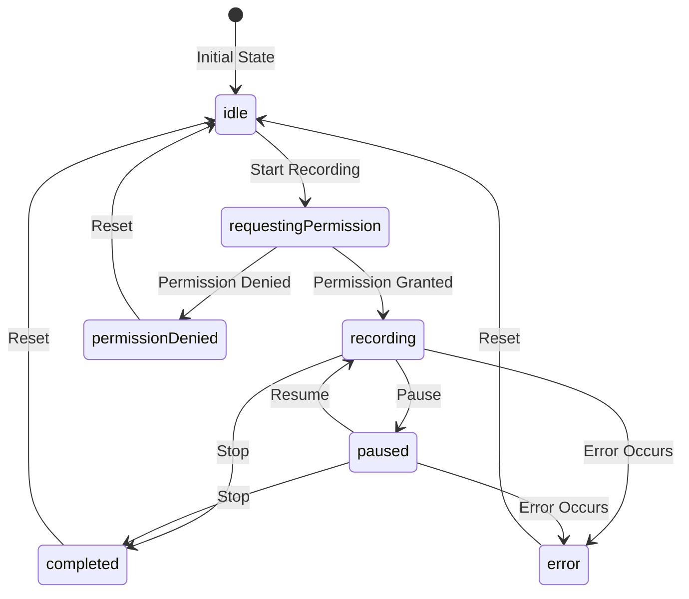

# State Management Implementation Plan

## Overview

This document outlines a plan to improve state management in the Marc With A Sea wedding application, focusing on supporting browser navigation while maintaining recording state and enforcing linear navigation flow.

## Current Issues

1. **Prop Drilling**: The App component passes state and handlers down through props.
2. **Distributed State Logic**: Recording state is duplicated across multiple components.
3. **Navigation Limitations**: Browser back/forward buttons don't maintain application state.
4. **Recording State Synchronization**: Multiple components maintain their own version of recording state.

## Goals

1. Support browser navigation (forward/back buttons) while maintaining recording state
2. Enforce linear navigation flow (only allow forward/backward transitions, not arbitrary jumps)
3. Centralize state management to eliminate duplication
4. Simplify component interfaces
5. Maintain recording state when navigating between steps

## Implementation Approach

We'll use a combination of React Router for URL-based navigation and Context API for state management. This approach is lightweight and appropriate for an application with a fixed feature set.

### Linear Navigation Flow

The application will enforce a strict linear flow:

```
welcome → recording → preview → upload → thankyou
```

With these allowed transitions:
- Forward: Move to the next step in sequence
- Backward: Move to the previous step in sequence
- Reset: Return to welcome from any step (cancel)
- Restart: Return to welcome after completion (record another)

We'll enforce this by:
1. Using route guards to prevent invalid direct URL access
2. Implementing navigation methods that validate transitions
3. Maintaining state requirements for each step (e.g., requiring guestInfo to access recording)

### Recording State Management

The current implementation has several issues with recording state management that need to be addressed:

1. **State Duplication**: Recording state is duplicated between AudioRecorder and WaveformVisualizer
2. **Imperative vs. Declarative APIs**: WaveformVisualizer uses an imperative API while React prefers declarative patterns
3. **Synchronization Issues**: Changes in one component may not be reflected in others
4. **Navigation Handling**: Recording state needs to be maintained during navigation

#### Recording State Lifecycle

To address these issues, we need to define a comprehensive recording state lifecycle:



#### Recording Engine Abstraction

We'll create a recording engine abstraction that coordinates between the MediaRecorder API, WaveSurfer.js, and our React components:

```typescript
// src/services/RecordingEngine.ts
export interface RecordingEngine {
  // Core recording methods
  initialize: () => Promise<void>;
  startRecording: () => Promise<void>;
  pauseRecording: () => void;
  resumeRecording: () => Promise<void>;
  stopRecording: () => Promise<Blob>;
  
  // Event handlers
  onVolumeChange?: (volume: number) => void;
  onRecordingStateChange?: (state: RecordingStateStatus) => void;
  onError?: (error: Error) => void;
  
  // Cleanup
  destroy: () => void;
}

export class WaveSurferRecordingEngine implements RecordingEngine {
  private wavesurfer: WaveSurfer | null = null;
  private recordPlugin: any = null;
  private container: HTMLElement;
  
  constructor(container: HTMLElement) {
    this.container = container;
  }
  
  // Implementation details...
}
```

#### WaveformVisualizer Integration

The WaveformVisualizer component will be refactored to work with our context and recording engine:

1. **Remove Duplicate State**: The component will no longer maintain its own recording state
2. **Use Context for State**: It will read recording state from context
3. **Provide Imperative API**: It will still expose an imperative API for the recording engine
4. **Forward Events to Context**: Recording events will be forwarded to the context

```typescript
// Updated WaveformVisualizer.tsx
export const WaveformVisualizer = forwardRef<WaveSurferControls, WaveformVisualizerProps>(({
  onRecordingComplete,
  onRecordingStart,
  onRecordingPause,
  onRecordingResume,
  className = '',
}, ref) => {
  // Get recording state from context
  const { isRecording, isPaused, startRecording, pauseRecording, 
          resumeRecording, stopRecording } = useRecording();
  
  // Local refs for WaveSurfer
  const containerRef = useRef<HTMLDivElement>(null);
  const wavesurfer = useRef<WaveSurfer | null>(null);
  const recordPlugin = useRef<ReturnType<typeof Record.create> | null>(null);
  
  // Initialize WaveSurfer and Record plugin
  useEffect(() => {
    // Initialization code...
    
    // Forward events to context
    if (recordPlugin.current) {
      recordPlugin.current.on('record-start', () => {
        onRecordingStart?.();
      });
      
      recordPlugin.current.on('record-end', (blob: Blob) => {
        onRecordingComplete?.(blob);
      });
      
      // Other event handlers...
    }
    
    // Cleanup function...
  }, [onRecordingComplete, onRecordingStart, onRecordingPause, onRecordingResume]);
  
  // Synchronize with context state
  useEffect(() => {
    if (!recordPlugin.current) return;
    
    if (isRecording && !isPaused) {
      // If context says we should be recording but we're not, start recording
      if (!recordPlugin.current.isRecording()) {
        recordPlugin.current.startRecording();
      }
    } else if (isRecording && isPaused) {
      // If context says we should be paused but we're not, pause recording
      if (recordPlugin.current.isRecording() && !recordPlugin.current.isPaused()) {
        recordPlugin.current.pauseRecording();
      }
    } else if (!isRecording) {
      // If context says we should not be recording but we are, stop recording
      if (recordPlugin.current.isRecording()) {
        recordPlugin.current.stopRecording();
      }
    }
  }, [isRecording, isPaused]);
  
  // Expose imperative API
  useImperativeHandle(ref, () => ({
    startRecording: async () => {
      if (recordPlugin.current && !isRecording) {
        await recordPlugin.current.startRecording();
        startRecording();
      }
    },
    stopRecording: () => {
      if (recordPlugin.current && isRecording) {
        recordPlugin.current.stopRecording();
      }
    },
    pauseRecording: () => {
      if (recordPlugin.current && isRecording && !isPaused) {
        recordPlugin.current.pauseRecording();
        pauseRecording();
      }
    },
    resumeRecording: () => {
      if (recordPlugin.current && isRecording && isPaused) {
        recordPlugin.current.resumeRecording();
        resumeRecording();
      }
    }
  }), [isRecording, isPaused, startRecording, pauseRecording, resumeRecording]);
  
  // Render component...
});
```

#### Enhanced RecordingContext

The RecordingContext will be enhanced to include more detailed recording state:

```typescript
// Enhanced RecordingContext.tsx
interface RecordingContextType {
  // Existing properties...
  
  // Enhanced recording state
  recordingStatus: RecordingStateStatus;
  currentVolume: number;
  recordingDuration: number;
  
  // Enhanced recording methods
  requestRecordingPermission: () => Promise<boolean>;
  handleRecordingError: (error: Error) => void;
  resetRecordingState: () => void;
}

// Implementation
export const RecordingProvider: React.FC<{ children: React.ReactNode }> = ({ children }) => {
  // Existing state...
  
  // Enhanced recording state
  const [recordingStatus, setRecordingStatus] = useState<RecordingStateStatus>({
    status: 'idle',
    duration: 0,
    volume: 0
  });
  
  // Recording engine ref
  const recordingEngineRef = useRef<RecordingEngine | null>(null);
  
  // Initialize recording engine
  const initializeRecordingEngine = useCallback((container: HTMLElement) => {
    if (!recordingEngineRef.current) {
      recordingEngineRef.current = new WaveSurferRecordingEngine(container);
      
      // Set up event handlers
      recordingEngineRef.current.onVolumeChange = (volume) => {
        setRecordingStatus(prev => ({ ...prev, volume }));
      };
      
      recordingEngineRef.current.onRecordingStateChange = (state) => {
        setRecordingStatus(state);
      };
      
      recordingEngineRef.current.onError = (error) => {
        setRecordingStatus(prev => ({ ...prev, status: 'error', error }));
      };
    }
  }, []);
  
  // Enhanced recording methods
  const requestRecordingPermission = useCallback(async () => {
    try {
      setRecordingStatus(prev => ({ ...prev, status: 'requestingPermission' }));
      
      const stream = await navigator.mediaDevices.getUserMedia({
        audio: {
          echoCancellation: true,
          noiseSuppression: true,
          sampleRate: 48000,
        }
      });
      
      // Stop the stream immediately - we'll request it again when recording starts
      stream.getTracks().forEach(track => track.stop());
      
      return true;
    } catch (err) {
      if (err instanceof Error && err.name === 'NotAllowedError') {
        setRecordingStatus(prev => ({ ...prev, status: 'permissionDenied' }));
      } else {
        const error = err instanceof Error
          ? err
          : new Error('Failed to access microphone');
        setRecordingStatus(prev => ({ ...prev, status: 'error', error }));
      }
      return false;
    }
  }, []);
  
  // Enhanced start recording method
  const startRecording = useCallback(async () => {
    if (!recordingEngineRef.current) return;
    
    try {
      await recordingEngineRef.current.startRecording();
      setIsRecording(true);
      setIsPaused(false);
      setRecordingStatus(prev => ({ ...prev, status: 'recording' }));
    } catch (err) {
      const error = err instanceof Error
        ? err
        : new Error('Failed to start recording');
      setRecordingStatus(prev => ({ ...prev, status: 'error', error }));
    }
  }, []);
  
  // Other enhanced methods...
  
  // Provide context value
  return (
    <RecordingContext.Provider value={{
      // Existing values...
      
      // Enhanced recording state
      recordingStatus,
      currentVolume: recordingStatus.volume,
      recordingDuration: recordingStatus.duration,
      
      // Enhanced recording methods
      requestRecordingPermission,
      handleRecordingError: (error) => setRecordingStatus(prev => ({ ...prev, status: 'error', error })),
      resetRecordingState: () => setRecordingStatus({ status: 'idle', duration: 0, volume: 0 }),
      initializeRecordingEngine
    }}>
      {children}
    </RecordingContext.Provider>
  );
};
```

#### AudioRecorder Integration

The AudioRecorder component will be updated to use the enhanced context:

```typescript
// Updated AudioRecorder.tsx
export function AudioRecorder({ 
  onRecordingComplete, 
  onCancel 
}: AudioRecorderProps) {
  // Get enhanced recording state from context
  const { 
    recordingStatus, 
    currentVolume,
    requestRecordingPermission,
    startRecording,
    pauseRecording,
    resumeRecording,
    stopRecording,
    handleRecordingError,
    initializeRecordingEngine
  } = useRecording();
  
  // Reference to container for WaveSurfer
  const containerRef = useRef<HTMLDivElement>(null);
  
  // Initialize recording engine when component mounts
  useEffect(() => {
    if (containerRef.current) {
      initializeRecordingEngine(containerRef.current);
    }
  }, [initializeRecordingEngine]);
  
  // Handle recording start
  const handleStartRecording = useCallback(async () => {
    const hasPermission = await requestRecordingPermission();
    if (hasPermission) {
      await startRecording();
    }
  }, [requestRecordingPermission, startRecording]);
  
  // Render based on recording status
  if (recordingStatus.status === 'permissionDenied') {
    return (
      <div className="max-w-lg mx-auto">
        <div className="rounded-lg bg-red-50 p-4 border border-red-200">
          <h3 className="text-lg font-medium text-red-800">
            Microphone Access Denied
          </h3>
          <p className="mt-2 text-sm text-red-700">
            Microphone access is required for audio recording. Please check your
            browser settings to allow microphone access for this site.
          </p>
          <div className="mt-4">
            <button
              onClick={onCancel}
              className="bg-gray-100 hover:bg-gray-200 text-gray-800 font-medium py-2 px-4 rounded-lg transition-colors"
            >
              Cancel
            </button>
          </div>
        </div>
      </div>
    );
  }
  
  // Main component rendering
  return (
    <div className="space-y-6">
      {/* Error handling modal */}
      <ErrorModal
        isOpen={recordingStatus.status === 'error'}
        onClose={() => handleRecordingError(null)}
        title="Recording Error"
        description={recordingStatus.error ? recordingStatus.error.message : 'An unknown error occurred while recording audio.'}
        action={{
          label: 'Try Again',
          onClick: () => {
            handleRecordingError(null);
            if (recordingStatus.status === 'paused') {
              resumeRecording();
            } else {
              handleStartRecording();
            }
          }
        }}
      />
      
      {/* Rest of component... */}
    </div>
  );
}
```

## Implementation Plan

### Phase 1: Add React Router

1. **Install Dependencies**
   ```bash
   npm install react-router-dom
   ```

2. **Define Routes**
   Create a route structure that matches the application flow:
   ```typescript
   // App.tsx
   import { BrowserRouter, Routes, Route, Navigate } from 'react-router-dom';

   function App() {
     return (
       <BrowserRouter>
         <main className="min-h-screen flex items-center justify-center bg-gradient-to-b from-blue-50 to-white p-4">
           <div className="w-full max-w-2xl bg-white rounded-xl shadow-lg p-4 sm:p-6 md:p-8">
             <h1 className="text-2xl sm:text-3xl md:text-4xl font-bold text-center mb-4 sm:mb-6 md:mb-8 text-gray-800">
               Marc & Sea's Wedding
             </h1>
             
             <BrowserCheck onCompatibilityChange={setBrowserCompatibility} />
             
             {browserCompatibility.hasAudioSupport && (
               <Routes>
                 <Route path="/" element={<Navigate to="/welcome" />} />
                 <Route path="/welcome" element={<WelcomeView />} />
                 <Route path="/recording" element={<RecordingView />} />
                 <Route path="/preview" element={<PreviewView />} />
                 <Route path="/upload" element={<UploadView />} />
                 <Route path="/thankyou" element={<ThankYouView />} />
                 <Route path="*" element={<Navigate to="/welcome" />} />
               </Routes>
             )}
           </div>
         </main>
       </BrowserRouter>
     );
   }
   ```

3. **Create View Components**
   Create wrapper components for each step that will use the existing components:
   ```typescript
   // src/views/WelcomeView.tsx
   import { WelcomeForm } from '../components/WelcomeForm';
   
   export function WelcomeView() {
     // Initially, keep using the existing state and handlers from App.tsx
     // We'll refactor this in Phase 2
     return <WelcomeForm onSubmit={handleGuestInfo} />;
   }
   ```

### Phase 2: Create Recording Context

1. **Define Context Interface**
   ```typescript
   // src/context/RecordingContext.tsx
   import { createContext, useContext, useState, useRef, useCallback } from 'react';
   import { useNavigate, useLocation } from 'react-router-dom';
   import { GuestInfo, RecordingState } from '../types';

   interface RecordingContextType {
     // Current step
     currentStep: RecordingState;
     
     // State
     guestInfo: GuestInfo | null;
     audioBlob: Blob | null;
     uploadProgress: number;
     isRecording: boolean;
     isPaused: boolean;
     
     // Navigation methods
     goToNextStep: () => void;
     goToPreviousStep: () => void;
     resetFlow: () => void;
     
     // Recording methods
     startRecording: () => void;
     pauseRecording: () => void;
     resumeRecording: () => void;
     stopRecording: (blob: Blob) => void;
     cancelRecording: () => void;
     
     // Other methods
     setGuestInfo: (info: GuestInfo) => void;
     startUpload: () => void;
     recordAnother: () => void;
   }
   ```

2. **Implement Context Provider**
   ```typescript
   const RecordingContext = createContext<RecordingContextType | undefined>(undefined);

   // Define the sequence of steps for linear navigation
   const STEPS: RecordingState[] = ['welcome', 'recording', 'preview', 'upload', 'thankyou'];

   export const RecordingProvider: React.FC<{ children: React.ReactNode }> = ({ children }) => {
     // State
     const [currentStep, setCurrentStep] = useState<RecordingState>('welcome');
     const [guestInfo, setGuestInfo] = useState<GuestInfo | null>(null);
     const [audioBlob, setAudioBlob] = useState<Blob | null>(null);
     const [uploadProgress, setUploadProgress] = useState(0);
     const [isRecording, setIsRecording] = useState(false);
     const [isPaused, setIsPaused] = useState(false);
     
     const navigate = useNavigate();
     const location = useLocation();
     
     // Refs for recording functionality
     const waveformRef = useRef<any>(null);
     const uploadIntervalRef = useRef<number | null>(null);
     
     // Get current step index
     const getCurrentStepIndex = () => STEPS.indexOf(currentStep);
     
     // Navigation methods with validation
     const goToNextStep = useCallback(() => {
       const currentIndex = getCurrentStepIndex();
       if (currentIndex < STEPS.length - 1) {
         const nextStep = STEPS[currentIndex + 1];
         
         // Validate transition
         if (nextStep === 'recording' && !guestInfo) {
           return; // Can't go to recording without guest info
         }
         
         if (nextStep === 'preview' && !audioBlob) {
           return; // Can't go to preview without a recording
         }
         
         setCurrentStep(nextStep);
         navigate(`/${nextStep}`);
       }
     }, [currentStep, guestInfo, audioBlob, navigate]);
     
     const goToPreviousStep = useCallback(() => {
       const currentIndex = getCurrentStepIndex();
       if (currentIndex > 0) {
         const prevStep = STEPS[currentIndex - 1];
         setCurrentStep(prevStep);
         navigate(`/${prevStep}`);
         
         // If going back to recording from preview, ensure recording is paused
         if (currentStep === 'preview' && prevStep === 'recording' && isRecording && !isPaused) {
           setIsPaused(true);
           // Actual pause functionality would be called here
         }
       }
     }, [currentStep, isRecording, isPaused, navigate]);
     
     const resetFlow = useCallback(() => {
       setCurrentStep('welcome');
       setGuestInfo(null);
       setAudioBlob(null);
       setUploadProgress(0);
       setIsRecording(false);
       setIsPaused(false);
       navigate('/welcome');
       
       // Clear any intervals
       if (uploadIntervalRef.current) {
         clearInterval(uploadIntervalRef.current);
         uploadIntervalRef.current = null;
       }
     }, [navigate]);
     
     // Handle browser navigation events
     useEffect(() => {
       // Map URL path to step
       const path = location.pathname.substring(1); // Remove leading slash
       const validStep = STEPS.includes(path as RecordingState) ? path as RecordingState : 'welcome';
       
       // If URL doesn't match current step, update current step
       if (validStep !== currentStep) {
         // Validate transition
         const currentIndex = getCurrentStepIndex();
         const newIndex = STEPS.indexOf(validStep);
         
         // Only allow moving one step forward or backward
         if (Math.abs(newIndex - currentIndex) <= 1) {
           setCurrentStep(validStep);
           
           // If navigating away from recording and recording is active, pause it
           if (currentStep === 'recording' && isRecording && !isPaused) {
             setIsPaused(true);
             // Actual pause functionality would be called here
           }
         } else {
           // Invalid transition, navigate back to current step
           navigate(`/${currentStep}`);
         }
       }
     }, [location.pathname, currentStep, isRecording, isPaused, navigate]);
     
     // Recording methods
     const startRecording = useCallback(() => {
       setIsRecording(true);
       setIsPaused(false);
       // Actual start recording functionality would be called here
     }, []);
     
     const pauseRecording = useCallback(() => {
       setIsPaused(true);
       // Actual pause functionality would be called here
     }, []);
     
     const resumeRecording = useCallback(() => {
       setIsPaused(false);
       // Actual resume functionality would be called here
     }, []);
     
     const stopRecording = useCallback((blob: Blob) => {
       setAudioBlob(blob);
       setIsRecording(false);
       setIsPaused(false);
       goToNextStep(); // Move to preview
     }, [goToNextStep]);
     
     const cancelRecording = useCallback(() => {
       setIsRecording(false);
       setIsPaused(false);
       setAudioBlob(null);
       resetFlow();
     }, [resetFlow]);
     
     // Guest info handler
     const handleGuestInfo = useCallback((info: GuestInfo) => {
       setGuestInfo(info);
       goToNextStep(); // Move to recording
     }, [goToNextStep]);
     
     // Upload methods
     const startUpload = useCallback(() => {
       goToNextStep(); // Move to upload
       
       // Mock upload progress for now
       let progress = 0;
       uploadIntervalRef.current = window.setInterval(() => {
         progress += 10;
         setUploadProgress(progress);
         if (progress >= 100) {
           if (uploadIntervalRef.current) {
             clearInterval(uploadIntervalRef.current);
             uploadIntervalRef.current = null;
           }
           goToNextStep(); // Move to thank you
         }
       }, 500);
     }, [goToNextStep]);
     
     const recordAnother = useCallback(() => {
       resetFlow();
     }, [resetFlow]);
     
     // Register waveform ref
     const registerWaveformRef = useCallback((ref: any) => {
       waveformRef.current = ref;
     }, []);
     
     return (
       <RecordingContext.Provider value={{
         // State
         currentStep,
         guestInfo,
         audioBlob,
         uploadProgress,
         isRecording,
         isPaused,
         
         // Navigation methods
         goToNextStep,
         goToPreviousStep,
         resetFlow,
         
         // Recording methods
         startRecording,
         pauseRecording,
         resumeRecording,
         stopRecording,
         cancelRecording,
         
         // Other methods
         setGuestInfo: handleGuestInfo,
         startUpload,
         recordAnother,
         registerWaveformRef
       }}>
         {children}
       </RecordingContext.Provider>
     );
   };

   export const useRecording = () => {
     const context = useContext(RecordingContext);
     if (context === undefined) {
       throw new Error('useRecording must be used within a RecordingProvider');
     }
     return context;
   };
   ```

### Phase 3: Update View Components

1. **Update WelcomeView**
   ```typescript
   // src/views/WelcomeView.tsx
   import { useRecording } from '../context/RecordingContext';
   import { WelcomeForm } from '../components/WelcomeForm';
   
   export function WelcomeView() {
     const { setGuestInfo } = useRecording();
     
     return <WelcomeForm onSubmit={setGuestInfo} />;
   }
   ```

2. **Update RecordingView**
   ```typescript
   // src/views/RecordingView.tsx
   import { useEffect } from 'react';
   import { useRecording } from '../context/RecordingContext';
   import { AudioRecorder } from '../components/AudioRecorder';
   
   export function RecordingView() {
     const { 
       guestInfo, 
       isRecording, 
       isPaused,
       startRecording,
       pauseRecording,
       resumeRecording,
       stopRecording,
       cancelRecording,
       goToPreviousStep,
       registerWaveformRef
     } = useRecording();
     
     // Redirect if no guest info
     useEffect(() => {
       if (!guestInfo) {
         goToPreviousStep();
       }
     }, [guestInfo, goToPreviousStep]);
     
     // If we have guest info, show the recorder
     return guestInfo ? (
       <AudioRecorder
         onRecordingComplete={stopRecording}
         onCancel={cancelRecording}
         onWaveformRef={registerWaveformRef}
       />
     ) : null;
   }
   ```

3. **Update PreviewView**
   ```typescript
   // src/views/PreviewView.tsx
   import { useEffect } from 'react';
   import { useRecording } from '../context/RecordingContext';
   
   export function PreviewView() {
     const { 
       audioBlob, 
       startUpload, 
       cancelRecording,
       goToPreviousStep
     } = useRecording();
     
     // Redirect if no audio blob
     useEffect(() => {
       if (!audioBlob) {
         goToPreviousStep();
       }
     }, [audioBlob, goToPreviousStep]);
     
     return audioBlob ? (
       <div className="space-y-4">
         <p className="text-center text-gray-600">
           Preview coming in Phase 3...
         </p>
         <div className="flex justify-center space-x-4">
           <button
             onClick={startUpload}
             className="bg-blue-500 hover:bg-blue-600 text-white font-medium py-2 px-6 rounded-lg transition-colors"
           >
             Continue
           </button>
           <button
             onClick={cancelRecording}
             className="bg-gray-100 hover:bg-gray-200 text-gray-800 font-medium py-2 px-4 rounded-lg transition-colors"
           >
             Cancel
           </button>
         </div>
       </div>
     ) : null;
   }
   ```

4. **Update UploadView**
   ```typescript
   // src/views/UploadView.tsx
   import { useEffect } from 'react';
   import { useRecording } from '../context/RecordingContext';
   import { UploadProgress } from '../components/UploadProgress';
   
   export function UploadView() {
     const { 
       guestInfo, 
       audioBlob, 
       uploadProgress,
       goToNextStep,
       goToPreviousStep
     } = useRecording();
     
     // Redirect if missing required data
     useEffect(() => {
       if (!guestInfo || !audioBlob) {
         goToPreviousStep();
       }
     }, [guestInfo, audioBlob, goToPreviousStep]);
     
     return guestInfo && audioBlob ? (
       <UploadProgress
         fileName={`${guestInfo.name}'s Message.wav`}
         progress={uploadProgress}
         status={uploadProgress < 100 ? 'uploading' : 'completed'}
         onComplete={goToNextStep}
       />
     ) : null;
   }
   ```

5. **Update ThankYouView**
   ```typescript
   // src/views/ThankYouView.tsx
   import { useRecording } from '../context/RecordingContext';
   import { ThankYou } from '../components/ThankYou';
   
   export function ThankYouView() {
     const { guestInfo, recordAnother } = useRecording();
     
     return guestInfo ? (
       <ThankYou
         guestName={guestInfo.name}
         onRecordAnother={recordAnother}
       />
     ) : null;
   }
   ```

### Phase 4: Update AudioRecorder Component

1. **Modify AudioRecorder to work with Context**
   ```typescript
   // src/components/AudioRecorder.tsx
   import { useCallback, useEffect, useRef, useState } from 'react'
   import { CountdownTimer } from './CountdownTimer'
   import { VolumeIndicator } from './VolumeIndicator'
   import { WaveformVisualizer, type WaveSurferControls } from './WaveformVisualizer'
   import { useAudioVolume } from '../hooks/useAudioRecording'
   import { ErrorModal } from './ErrorModal'
   import { useRecording } from '../context/RecordingContext'

   interface AudioRecorderProps {
     onRecordingComplete: (blob: Blob) => void
     onCancel: () => void
     onWaveformRef?: (ref: WaveSurferControls) => void
   }

   export function AudioRecorder({ 
     onRecordingComplete, 
     onCancel,
     onWaveformRef
   }: AudioRecorderProps) {
     // Get recording state from context
     const { isRecording, isPaused, startRecording: contextStartRecording, 
             pauseRecording: contextPauseRecording, resumeRecording: contextResumeRecording } = useRecording();
     
     // Local state for UI and error handling
     const [isPermissionDenied, setIsPermissionDenied] = useState(false);
     const [error, setError] = useState<Error | null>(null);
     
     // Reference to WaveformVisualizer for imperative control
     const waveformRef = useRef<WaveSurferControls>(null);
     
     // Register waveform ref with context if provided
     useEffect(() => {
       if (onWaveformRef && waveformRef.current) {
         onWaveformRef(waveformRef.current);
       }
     }, [onWaveformRef]);
     
     // Volume analysis hook
     const { currentVolume, error: volumeError, initializeAnalysis, stopAnalysis } = useAudioVolume({
       minDecibels: -40,
       maxDecibels: -10
     });

     // Rest of the component remains largely the same, but uses context state
     // and methods where appropriate
     
     // ...existing methods with context integration...
     
     // Example of how handleRecordingStart would change:
     const handleRecordingStart = useCallback(async () => {
       contextStartRecording(); // Update context state
       
       try {
         // Get fresh MediaStream for volume analysis
         const stream = await navigator.mediaDevices.getUserMedia({
           audio: {
             echoCancellation: true,
             noiseSuppression: true,
             sampleRate: 48000,
           }
         });
         initializeAnalysis(stream);
       } catch (err) {
         // Handle errors...
       }
     }, [contextStartRecording, initializeAnalysis]);
     
     // Similar updates for other handlers...
     
     // Rest of component remains the same
   }
   ```

### Phase 5: Update App Component

1. **Simplify App.tsx**
   ```typescript
   // src/App.tsx
   import { BrowserRouter, Routes, Route, Navigate } from 'react-router-dom';
   import { useState } from 'react';
   import { RecordingProvider } from './context/RecordingContext';
   import { BrowserCheck } from './components/BrowserCheck';
   import { WelcomeView } from './views/WelcomeView';
   import { RecordingView } from './views/RecordingView';
   import { PreviewView } from './views/PreviewView';
   import { UploadView } from './views/UploadView';
   import { ThankYouView } from './views/ThankYouView';
   import { ProgressIndicator } from './components/ProgressIndicator';
   import { BrowserCompatibility } from './types';

   function App() {
     const [browserCompatibility, setBrowserCompatibility] = useState<BrowserCompatibility>({
       hasAudioSupport: false,
       hasMicrophonePermission: false,
       hasWaveSurferSupport: false
     });

     return (
       <BrowserRouter>
         <RecordingProvider>
           <main className="min-h-screen flex items-center justify-center bg-gradient-to-b from-blue-50 to-white p-4">
             <div className="w-full max-w-2xl bg-white rounded-xl shadow-lg p-4 sm:p-6 md:p-8">
               <h1 className="text-2xl sm:text-3xl md:text-4xl font-bold text-center mb-4 sm:mb-6 md:mb-8 text-gray-800">
                 Marc & Sea's Wedding
               </h1>
               
               <BrowserCheck onCompatibilityChange={setBrowserCompatibility} />
               
               {browserCompatibility.hasAudioSupport && (
                 <>
                   <div className="space-y-4 sm:space-y-6">
                     <Routes>
                       <Route path="/" element={<Navigate to="/welcome" />} />
                       <Route path="/welcome" element={<WelcomeView />} />
                       <Route path="/recording" element={<RecordingView />} />
                       <Route path="/preview" element={<PreviewView />} />
                       <Route path="/upload" element={<UploadView />} />
                       <Route path="/thankyou" element={<ThankYouView />} />
                       <Route path="*" element={<Navigate to="/welcome" />} />
                     </Routes>
                   </div>

                   <div className="mt-4 sm:mt-6 md:mt-8">
                     <CurrentStepIndicator />
                   </div>
                 </>
               )}
             </div>
           </main>
         </RecordingProvider>
       </BrowserRouter>
     );
   }

   // Helper component to show progress indicator based on current route
   function CurrentStepIndicator() {
     const { currentStep } = useRecording();
     return <ProgressIndicator currentState={currentStep} />;
   }

   export default App;
   ```

## Testing Strategy

### Unit Tests

1. **Context Tests**
   - Test navigation methods enforce linear flow
   - Test state transitions work correctly
   - Test recording state is maintained during navigation

2. **Component Tests**
   - Test view components redirect when missing required state
   - Test AudioRecorder integrates correctly with context
   - Test browser compatibility check works

### Integration Tests

1. **Navigation Flow Tests**
   - Test forward navigation through all steps
   - Test backward navigation through all steps
   - Test browser back/forward buttons maintain state
   - Test invalid URL access is redirected appropriately

2. **Recording State Tests**
   - Test recording pauses when navigating away
   - Test recording state is maintained when returning
   - Test recording can be resumed after navigation

### Manual Testing Checklist

1. **Browser Navigation**
   - [ ] Start recording, use browser back button, then forward button - recording should pause and maintain state
   - [ ] Complete recording, navigate to preview, use back button to return to recording - should see paused recording
   - [ ] Try to access upload URL directly - should redirect to appropriate step
   - [ ] Complete full flow, then use back button multiple times - should maintain appropriate state

2. **Recording State**
   - [ ] Start recording, pause, navigate away and back - should remain paused
   - [ ] Start recording, navigate away and back - should be paused
   - [ ] Complete recording, preview, then go back to recording - should see recording controls with existing recording

3. **Error Handling**
   - [ ] Test microphone permission denial
   - [ ] Test browser compatibility issues
   - [ ] Test recording errors

## Implementation Timeline

1. **Phase 1: React Router Setup** - 1 day
   - Install dependencies
   - Set up routes
   - Create view component shells

2. **Phase 2: Context Implementation** - 2 days
   - Create context with state and methods
   - Implement navigation logic
   - Add browser history integration

3. **Phase 3: Component Updates** - 2 days
   - Update view components to use context
   - Modify AudioRecorder to work with context
   - Test integration

4. **Phase 4: Testing and Refinement** - 1 day
   - Test all navigation paths
   - Fix any issues
   - Document implementation

## Conclusion

This implementation plan provides a structured approach to improving state management in the Marc With A Sea wedding application. By using React Router for navigation and Context API for state management, we can support browser navigation while maintaining recording state and enforcing a linear flow.

The phased approach allows for incremental implementation and testing, minimizing the risk of breaking existing functionality. The final solution will provide a better user experience by supporting browser navigation and maintaining state consistency throughout the application flow.
