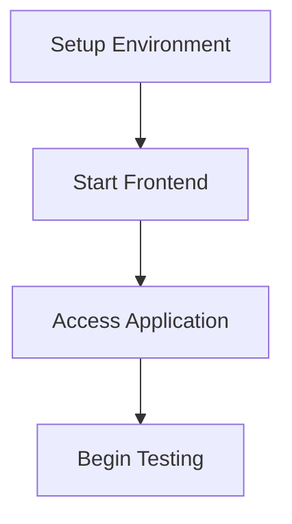

# Marc With A Sea Wedding Website - Testing Plan

## Testing Infrastructure

The application uses:
- **Vitest** - Test runner and framework
- **Testing Library** - For React component testing
- **Happy DOM** - For DOM environment
- **Mock implementations** - For MediaStream and browser APIs

## Test Organization

```
src/
  __tests__/           # Global test utilities
  components/
    __tests__/        # Component-specific tests
  context/
    __tests__/        # Context tests
  hooks/
    __tests__/        # Hook tests
  views/
    __tests__/        # View tests
  test/
    mocks/            # Mock implementations
    setup/            # Test setup files
```

## Running Tests

Tests can be run using:

```bash
# Run all tests
npm run test

# Run tests with coverage
npm run test:coverage

# Run specific tests
npx vitest <test-file-pattern>
```

## Test Coverage Goals

The current test coverage meets the following targets:
- Statements: 80%
- Branches: 75%
- Functions: 80%
- Lines: 80%

# Phase 1: Frontend Testing

## 1. Local Development Setup



### Frontend Setup
- Run `npm run dev` in the project root to start the Vite development server
- This will serve the React application on http://localhost:5173
- No backend setup required for initial testing phase

## 2. Component Testing (Frontend Only)

### 2.1 Welcome Form (Priority: High)
- Test form validation:
  - Submit with empty name
  - Submit with valid name
  - Test optional email field validation

### 2.2 Audio Recording
- Test microphone permissions:
  - Allow permissions
  - Deny permissions (should show error)
- Test recording controls:
  - Start recording
  - Pause recording
  - Resume recording
  - Stop recording
- Test volume visualization:
  - Verify volume indicator responds to audio input
  - Verify waveform visualization works

### 2.3 Audio Playback
- Test playback controls:
  - Play recorded audio
  - Pause playback
  - Verify waveform visualization during playback
- Test audio quality:
  - Record sample messages of different lengths
  - Verify audio clarity and quality

### 2.4 Upload Functionality (Using Mock Implementation)
- Test upload process with mock implementation:
  - Verify upload UI flow
  - Test progress indicator
  - Check completion states
- Test error handling with simulated errors:
  - Network disconnection simulation
  - Generic error states
  - Retry functionality

### 2.5 UI States
- Test state transitions:
  - Welcome → Recording → Preview → Upload → Thank You
  - Test back navigation where applicable
  - Test cancel functionality

## 3. Implemented Tests

The following tests have been implemented:

### Component Tests
- Basic UI components (WelcomeForm, AudioRecorder, etc.)
- Visual components (ProgressBar, LoadingSpinner, etc.)
- Interactive elements (CountdownTimer, VolumeIndicator, etc.)

### Context Tests
- RecordingContext navigation methods
- State transitions in RecordingContext
- Context provider functionality

### Hook Tests
- useAudioRecording hook
- useUpload hook

### View Tests
- View component redirects
- Navigation validation
- Basic rendering and interactions

# Phase 2: Backend Integration
(To be implemented after frontend testing is complete)

## 4. Backend Setup and Testing
- Verify worker starts correctly
- Test R2 bucket configuration:
  - Create test bucket if not exists
  - Verify read/write permissions

### 4.1 API Endpoints
- Test `/upload` endpoint:
  - Send valid requests with proper authentication
  - Send requests with invalid authentication
  - Send malformed requests
  - Test file size limits

### 4.2 File Storage
- Verify files are stored correctly in R2
- Check metadata is properly attached to files
- Verify filename format follows the pattern: `timestamp-guest-name.webm`

## 5. Integration Testing

### 5.1 End-to-End Flow
- Complete the entire user journey:
  1. Enter guest information
  2. Record a message
  3. Preview and approve
  4. Upload to backend
  5. Verify thank you screen

### 5.2 Cross-Browser Testing
- Test on multiple browsers:
  - Chrome
  - Firefox
  - Safari
  - Edge
- Test on mobile devices:
  - iOS Safari
  - Android Chrome

## 6. Performance Testing

### 6.1 Recording Performance
- Test with long recordings (near 15-minute limit)
- Monitor memory usage during extended recordings
- Test with various audio input qualities

### 6.2 Upload Performance
- Test uploading large files
- Measure upload speeds and optimize if needed
- Test upload progress accuracy

## 7. Security Testing

### 7.1 Authentication
- Verify upload token validation works
- Test with invalid tokens
- Test with missing tokens

### 7.2 Input Validation
- Test with malformed input data
- Test with unexpected file types
- Test with extremely large files

# Future Improvements

Areas for future test improvement include:

1. **MediaStream Testing**
   - Enhanced mock implementation
   - Simulated audio inputs

2. **Permission Handling**
   - Comprehensive permission test cases
   - Browser-specific behavior testing

3. **Error Scenarios**
   - Network failure simulation
   - Recovery procedure testing

4. **State Persistence**
   - Browser refresh handling
   - Navigation state preservation testing

# Implementation Plan

To implement this testing plan:

1. **Set up local environment**:
   - Configure worker secrets for local development
   - Create test R2 bucket

2. **Complete backend implementation**:
   - Finish the upload functionality in the frontend
   - Connect to the worker backend

3. **Create test scripts**:
   - Automated tests for critical paths
   - Manual test checklist for UI verification

4. **Document test results**:
   - Track issues and fixes
   - Document browser compatibility