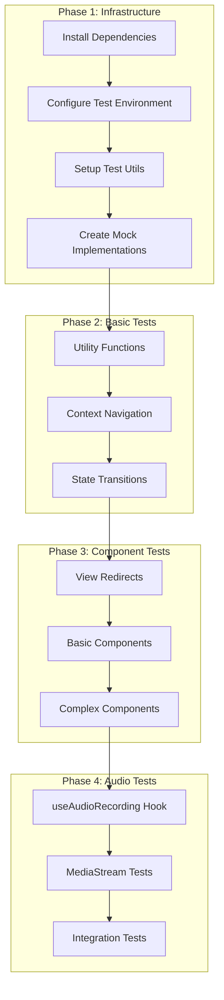

# Unit Testing Implementation Plan

## Overview

This document outlines the implementation plan for comprehensive unit testing of the Marc With A Sea wedding application, with a focus on testing state management, audio recording functionality, and component interactions.



## 1. Testing Infrastructure Setup

### 1.1 Dependencies Installation

```bash
npm install -D vitest @testing-library/react @testing-library/user-event @testing-library/jest-dom jsdom @vitest/coverage-c8 happy-dom
```

### 1.2 Test Configuration

Create `vitest.config.ts`:

```typescript
/// <reference types="vitest" />
import { defineConfig } from 'vite';
import react from '@vitejs/plugin-react';

export default defineConfig({
  plugins: [react()],
  test: {
    environment: 'happy-dom',
    globals: true,
    setupFiles: ['./src/test/setup.ts'],
    coverage: {
      provider: 'c8',
      reporter: ['text', 'json', 'html'],
      exclude: [
        'node_modules/**',
        'src/test/**',
      ],
    },
  },
});
```

### 1.3 Test Setup File

Create `src/test/setup.ts`:

```typescript
import '@testing-library/jest-dom';
import { cleanup } from '@testing-library/react';
import { afterEach } from 'vitest';

// Clean up after each test
afterEach(() => {
  cleanup();
});
```

### 1.4 Mock Implementations

Create `src/test/mocks/`:

#### 1.4.1 MediaStream Mock (`media-stream.mock.ts`)

```typescript
export class MediaStreamMock implements MediaStream {
  private tracks: MediaStreamTrack[] = [];
  
  constructor(tracks: MediaStreamTrack[] = []) {
    this.tracks = tracks;
  }

  addTrack(track: MediaStreamTrack): void {
    this.tracks.push(track);
  }

  removeTrack(track: MediaStreamTrack): void {
    this.tracks = this.tracks.filter(t => t !== track);
  }

  getTracks(): MediaStreamTrack[] {
    return this.tracks;
  }

  getAudioTracks(): MediaStreamTrack[] {
    return this.tracks.filter(track => track.kind === 'audio');
  }

  // Implement other required MediaStream methods...
}
```

#### 1.4.2 AudioContext Mock (`audio-context.mock.ts`)

```typescript
export class AudioContextMock implements AudioContext {
  constructor() {
    // Initialize with default values
  }

  createMediaStreamSource(stream: MediaStream): MediaStreamAudioSourceNode {
    return {
      connect: () => {},
      disconnect: () => {},
      // Other required properties...
    } as MediaStreamAudioSourceNode;
  }

  createAnalyser(): AnalyserNode {
    return {
      connect: () => {},
      disconnect: () => {},
      fftSize: 2048,
      frequencyBinCount: 1024,
      getByteTimeDomainData: (array: Uint8Array) => {
        // Fill with mock audio data
        array.fill(128); // Silence
      },
      // Other required properties...
    } as AnalyserNode;
  }

  // Implement other required AudioContext methods...
}
```

#### 1.4.3 Test Utils (`test-utils.tsx`)

```typescript
import { render as rtlRender } from '@testing-library/react';
import { BrowserRouter } from 'react-router-dom';
import { RecordingProvider } from '../context/RecordingContext';

function render(ui: React.ReactElement, { route = '/' } = {}) {
  window.history.pushState({}, 'Test page', route);

  return rtlRender(
    <BrowserRouter>
      <RecordingProvider>
        {ui}
      </RecordingProvider>
    </BrowserRouter>
  );
}

export * from '@testing-library/react';
export { render };
```

## 2. Test Implementation Plan

### 2.1 Component Utility Functions

Location: `src/components/__tests__/utils.test.ts`

Test scenarios:
- Format duration
- Validate email format
- Calculate volume levels
- File size formatting

Example:
```typescript
import { formatDuration, formatFileSize } from '../utils';

describe('Utility Functions', () => {
  describe('formatDuration', () => {
    it('formats seconds correctly', () => {
      expect(formatDuration(65)).toBe('1:05');
    });
  });

  describe('formatFileSize', () => {
    it('formats file size in MB', () => {
      expect(formatFileSize(1024 * 1024)).toBe('1.0 MB');
    });
  });
});
```

### 2.2 RecordingContext Navigation Methods

Location: `src/context/__tests__/RecordingContext.test.tsx`

Test scenarios:
- Linear navigation flow
- Navigation restrictions
- Browser history integration
- State persistence during navigation

Example:
```typescript
import { renderHook, act } from '@testing-library/react';
import { useRecording } from '../RecordingContext';

describe('RecordingContext Navigation', () => {
  it('follows linear navigation flow', () => {
    const { result } = renderHook(() => useRecording());
    
    act(() => {
      result.current.goToNextStep();
    });
    
    expect(result.current.currentStep).toBe('recording');
  });
});
```

### 2.3 State Transitions in RecordingContext

Location: `src/context/__tests__/RecordingContext.test.tsx`

Test scenarios:
- Recording state changes
- Guest info updates
- Audio blob management
- Error handling

### 2.4 View Component Redirects

Location: `src/views/__tests__/`

Test scenarios:
- Missing state redirects
- Invalid route handling
- Permission-based access
- Navigation guard behavior

### 2.5 useAudioRecording Hook

Location: `src/hooks/__tests__/useAudioRecording.test.ts`

Test scenarios:
- Volume analysis initialization
- MediaStream handling
- Error states
- Cleanup behavior

### 2.6 MediaStream Testing Harness

Location: `src/test/harness/MediaStreamTestHarness.ts`

Features:
- Mock audio input simulation
- Volume level control
- Error injection
- Event timing control

## 3. Test Coverage Requirements

Minimum coverage targets:
- Statements: 80%
- Branches: 75%
- Functions: 80%
- Lines: 80%

Critical paths requiring 100% coverage:
- Recording state transitions
- Navigation flow validation
- Error handling in audio recording
- Permission handling

## 4. Implementation Schedule

1. **Week 1: Infrastructure (Days 1-2)**
   - Set up testing framework
   - Create mock implementations
   - Establish test utilities

2. **Week 1: Basic Tests (Days 3-5)**
   - Implement utility function tests
   - Add RecordingContext navigation tests
   - Create state transition tests

3. **Week 2: Component Tests (Days 1-3)**
   - Add view redirect tests
   - Implement basic component tests
   - Create complex component tests

4. **Week 2: Audio Tests (Days 4-5)**
   - Implement useAudioRecording tests
   - Create MediaStream tests
   - Add integration tests

## 5. Testing Guidelines

### 5.1 Test Organization

```
src/
  __tests__/           # Global test utilities
  components/
    __tests__/        # Component-specific tests
  context/
    __tests__/        # Context tests
  hooks/
    __tests__/        # Hook tests
  views/
    __tests__/        # View tests
  test/
    mocks/            # Mock implementations
    setup/            # Test setup files
    harness/          # Test harnesses
```

### 5.2 Naming Conventions

- Test files: `*.test.ts` or `*.test.tsx`
- Mock files: `*.mock.ts`
- Test utilities: `*-utils.ts`
- Test harnesses: `*Harness.ts`

### 5.3 Test Structure

```typescript
describe('Component/Feature Name', () => {
  // Setup
  beforeEach(() => {
    // Common setup
  });

  // Cleanup
  afterEach(() => {
    // Common cleanup
  });

  // Test categories
  describe('Functionality Category', () => {
    it('should perform specific action', () => {
      // Arrange
      // Act
      // Assert
    });
  });
});
```

## 6. Error Scenarios to Test

1. **Permission Handling**
   - Denied microphone access
   - Revoked permissions
   - Device disconnection

2. **Network Conditions**
   - Slow connections
   - Connection loss
   - Failed uploads

3. **Browser Compatibility**
   - Unsupported APIs
   - Different browser implementations
   - Mobile vs Desktop

4. **User Interactions**
   - Rapid state changes
   - Invalid navigation attempts
   - Concurrent operations

## 7. Integration Test Scenarios

1. **Complete Recording Flow**
   - Welcome → Recording → Preview → Upload → Thank You
   - Including state management
   - Browser navigation support

2. **Error Recovery Flows**
   - Recording failure recovery
   - Upload retry handling
   - Permission recovery

3. **State Persistence**
   - Browser refresh handling
   - Navigation state maintenance
   - Data preservation

## 8. Quality Metrics

1. **Performance Benchmarks**
   - Test execution time < 10s
   - Coverage reporting < 5s
   - CI integration < 5min

2. **Code Quality**
   - No test code duplication
   - Clear test descriptions
   - Maintainable mock implementations

3. **Documentation**
   - Updated README with test instructions
   - Clear test organization documentation
   - Mock usage examples

## 9. Future Improvements

1. **Testing Infrastructure**
   - Add visual regression testing
   - Implement E2E tests
   - Add performance testing

2. **Coverage**
   - Increase minimum coverage requirements
   - Add branch coverage requirements
   - Implement integration test coverage

3. **Automation**
   - Add CI/CD integration
   - Implement automatic test generation
   - Add testing reports

## 10. Resources

1. **Documentation**
   - Vitest: https://vitest.dev/
   - RTL: https://testing-library.com/react
   - MSW: https://mswjs.io/

2. **Tools**
   - Coverage viewer
   - Test explorer
   - Snapshot diff viewer

3. **Best Practices**
   - React component testing
   - Hook testing strategies
   - Context testing patterns
